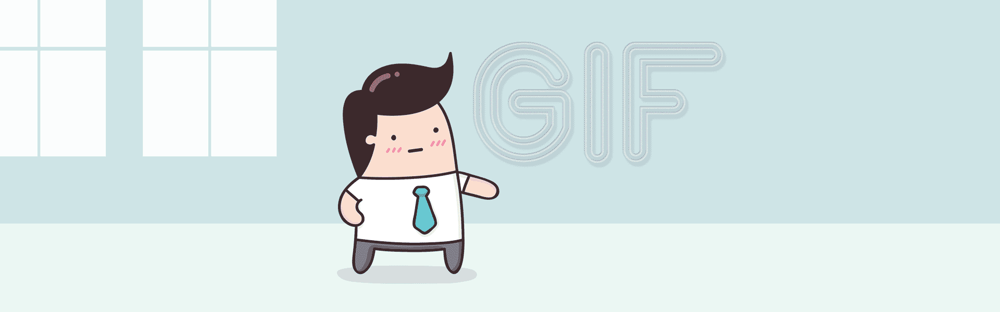

### Hello again, and welcome to another read 
today we will be discussing images, colors and texts, without further delay let us dig deep

# Images

Images are vital for any website design, as much as they grab the attention of the reader they also add certain style to the website,

when we choose an amage it should be relevent, clear and well placed

so how do we choose an appropriate image to the website,

first of all we have to learn how to add an image, and in order to do so we can use the < img> tag which goes as the following, 

        < img src = -source of the image- alt" />
after that we can control the height and the width of the image in pixels

we should always keep in mind three vital conditions when choosing an image 

1- *images should be in the right format*

2- *images should be in the right size*

3- *images should be in the right resolution*

ps: we can always rely on different softwares or websites to manipulate images as we wish such as adobe's photoshop or www.pixlr.com 

there are several factors to keep in mind, like cropping the image correctly, choosing a reolution that is not too high or too low, and consider the image transparancy 

we also can choose vector images which are usually black and white, or we can have GIF images

---

# Colors

colors add certain elegancy and life to your website, they are the difference between nice well made design or an ugly website that nobody wants to visit 

there are three ways to choose colors for your website 

A- **RGB values** which stands for Red, Green, Blue those are the fundemental foundation of any color the himan eye can see

B- **Hex codes**
this consists of 6 digit codes that make up a value of any color in the world, and because there millions of color combinations its impossible to memorize all the 6 digit codes so designers use websites like www.colorhunt.com

C- **Color names** it is the basic way of choosing colors, and the least advised one since it's limited and prone to repetetion often

colors are also affected by many elements such as hue, saturation, brightness, contrast and opacity

CSS introduced to us **HSL** and **HSLA** which stands for Hue, Saturation, Lightness and Alpha, these 4 elements can control the sharpness and crispiness of the colors 

keep in mind that it is vital to keep enough saturation between the text color and the background color 

---

# Texts

texts are governed by three major rules each containing its properties, see the screenshot from the ducket below

in addition to the font size, font family, uppercase, lowercase, text decoration like underline, overline, blink, strike, and line hight

we can manipulte texts in our webpage via word and letter spacing , text alignment like left, right, up and down,

not only patagraphs can be decorated, links also can be treated exactly as texts with few extra additions like hover, active and focus 

---

## JPEG vs PNG vs GIF — which image format to use and when?

> Use JPEG format for all images that contain a natural scene or photograph where variation in colour and intensity is smooth. Use PNG format for any image that needs transparency or for images with text & objects with sharp contrast edges like logos. Use GIF format for images that contain animations.
###### SOURCE: https://blog.imagekit.io/

Keep in mind that everything we see on the internet is compressed to ensure smoother and faster surfing experience, so images will be compressed too so we need to take care which format and size we choose, 

as we as what was said before we should consider factors like transperancy for examples JPEG format doesn't support transperancy so we cannot use it for logos, instead we choose png format, but if we want rich colofrul images we should chose jpeg format since it can hold up to 256 colors in one picture while png can hold only 24

and as for for animation gif is the only one of them that can support animation and its use has grown in the internet since its easy to load with a decent quality 

Thank you for taking the time to read my summary