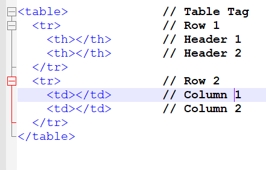
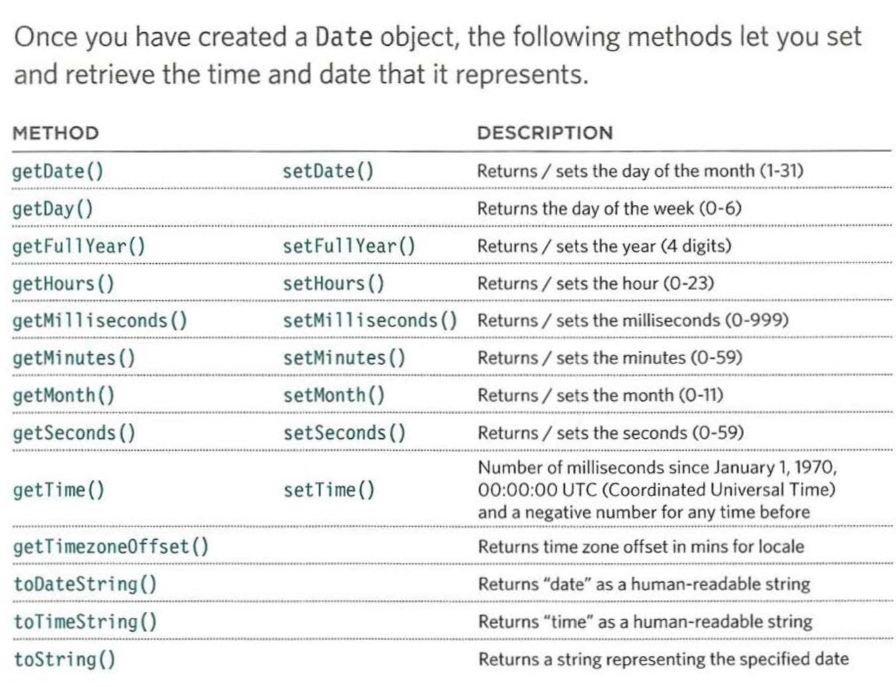

# Domain Modeling

> The domain model is a representation of meaningful real-world concepts pertinent to the domain that need to be modeled in software. The concepts include the data involved in the business and rules the business uses in relation to that data. A domain model leverages natural language of the domain.

we use domain modeling when domain model an an object model within a layer that uses a lower-level layer for persistence and "publishes" an API to a higher-level layer to gain access to the data and behavior of the model.

###### source: wikipedia.com

---

# Tables

tables allow us to show content in a grid view to help the reader compare multiple information in an orgnised way, 

and every table has a basic structure, first we use the **< table>** element to create the table, and fill the contesnts row by row using the **< tr>** which stands for table row followed by **< td>** which stands for table data, we also can use **< th>** which stands for table heading to specify which row colomn is the head of the table, not to mention that we can span a row or a colomn,

sometime we have to make long tables, and in these cases we have to use 

- < thead> : the heading of the table sits inside the it
- < tbody> : the body of the table sits inside it
- < tfoot> : the footer of the table sits inside it

the most facinating thing about tables is that we can design and shape them as we want like width, spacing, border and background,

---

# Functions, Methods, and Objects

### creating object literals

first we need new object using the constructor function **object ()**, now we have a blank object we can add properties and methods to it using dot notation and with each statement or method we end it with a semicolon,

### updating an object 

to update an object we use dot notation or square brackets and to delete it we use the **delete** keyword

### creating many objects

first we create an object with its properties and methods, then we give it properties that are considered as arguments to the function that are inside objects

### creating object usuing a constructor syntax

the image above clearly shows how to create an object using constructor syntax, 

### create and access objects using constructor notations 

if it hasn't been cleared out yet, constructor notaions help us make templates to make our code dry and clean for multiple data entries without without consuming much time, effort or personnel, and once we created them we can access them usin gdot notations 

note: wheather you're using object litteral or object constructor there's a key word that will help you a lot and it's **This**, 
**This helps you refer to one object inside the function that the function is operating on

### arrays are objects 
they are special type of objects because they hold special key and value pairs and they key of each value is its index number 

we can combine objects to create complex data structures, so that's why arrays are special because they can store a series and remember their order and vise versa objects can also hold arrays as value of their properties 

### built in objects

browsers have a set of built in objects like the browser window and these objects are helpful for the developers becuase they provide good tools for creating interactive web page

### math objects 

here are some examples of math object models for mathmatical constant and functions

|property | description|
| ---     |  ---   |
| Math.PI |Returns pi (approximately 3.14159265359)|
|Math. round()|Rounds number to the nearest integer|
|Math.sqrt(n)|Returnssquarerootofpositivenumber,e.g.,Math.sqrt(9) returns3|
|Math. cei 1()|Rounds number up to the nearest integer|
|Math.floor()|Rounds number down to the nearest integer|
|Math. random()|Generates a random number between 0 (inclusive) and 1(not inclusive)|

### date and time objects

below is an image from the Js Duckett that shows what syntax to use when working with date and time object

---
this sums up today's read, thank you for taking the time to read iy