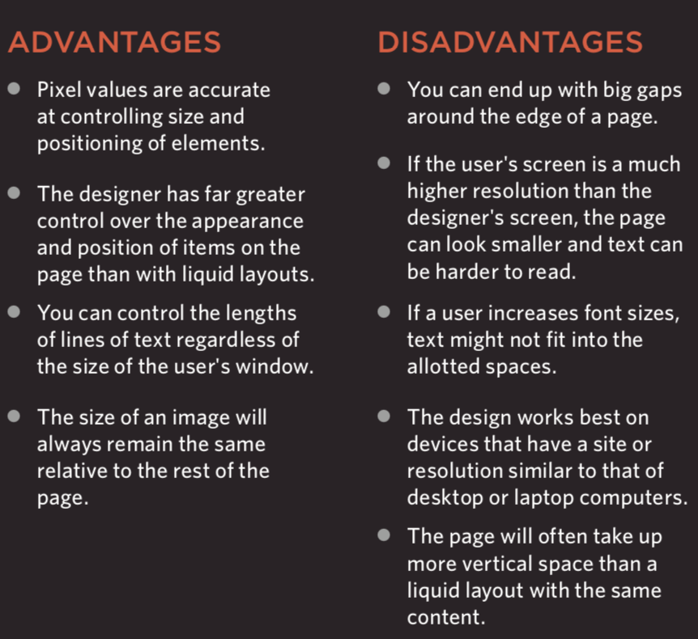
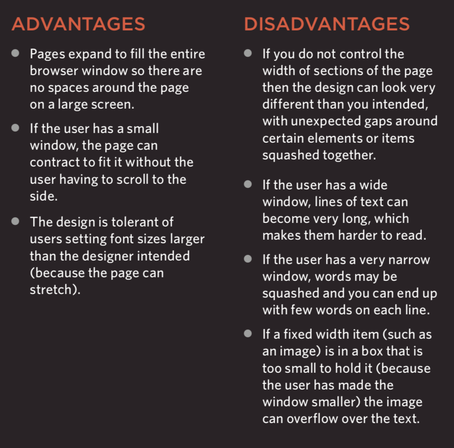
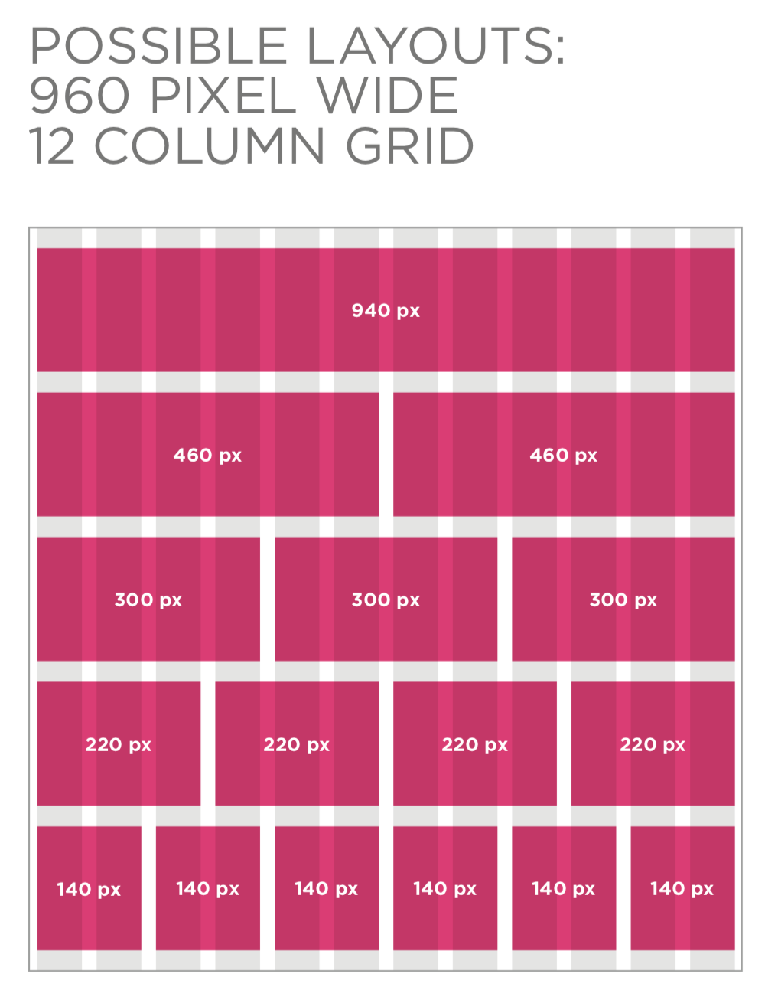
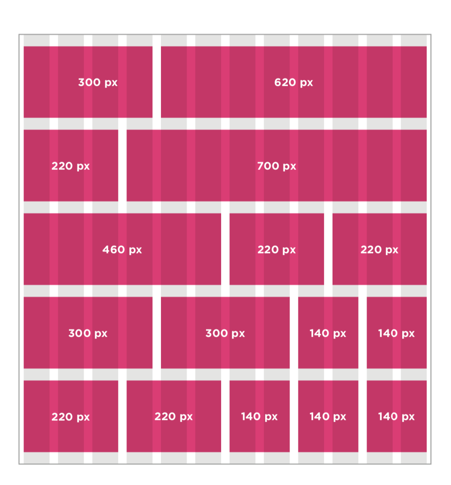

# Layout

we have talked about this topic in  [class-04](class-04.md) read, but today we are going to explain a bit further about layout and its importance in CSS

we know that understanding layout can help us control the position of of elements in the webpage, and in order to control these elements we it is crucial to remember that CSS treats each elemnt as a block element, same like Legos, and these elemnts can either be block levels elements or inline level elements 

* Block level elements start a new line such as < h1> < p> < ul> < li> tags 

* inline elements flow inbetween surrounding text such as < img> < b> < i> tags 

If one block-level element sits inside another block-level element then the outer box is known as the containing or **parent element**.

---

### controlling the position of elements 

here's where it can be tricky to do so but if we understood them contolling the layout of the page will be so much easy and fun 

* Normal flow: every element on the webpage appears lower to the one before, this is the default behavior of a css build without any medling from the programmer side
*(position:static)* 

* Relative positioning: This shifts the element from it's normal position to top, right, buttom or left in this particular order and does not affect the position of the surrounding elements, *(position:relative)*

* Absolute positioning : This positions the element in relation to its *parent element*, and elements in absolute positioning move with as the user scroll down or up the page, *(position:absolute)*

* Fixed positioning: this is like absulte positioning but the major difference is that the element positions itself in relation to the browser window no matter where the user scrolls the box will remain in its place maintaining that it stays on the screen, *(position:fixed)*

* Floating elements: this one allows the developer to be taken from normal flow to be positioned left or right to a box shifting it to a block level element which will make the content flow, *(position:float)*

-- side note: we should use box offset proprerty to tell the browser how far from left, right, top, or buttom the box should be positioned, but we should keep in mind that these boxes can overlap each other and will cause the webpage to look cluttery 

---

### clearing floats
*(clear)*
this property allows us to keep boxes from overlapping using values such as *left, right, both, and none*
but this might produce a problem that some browsers will these elements as zero pixels tall and to fix it developers usually put an extra element after the last floating one but the actual CSS solution would be to give to five the overflow a property value to auto and the width property is set to 100 

---

### creating multi colomn layout with floats 
because many websites have multi columns in their basic design which is created using the < div> element and with CSS we can use 

- width: this sets the width of the columns
- float: this positions the columns next to each other 
- margin: this creates a gap between the elements

---

### screen size

every visitor of the website will have a different device, some will use PC, others will use their phones or tablets, so as a designer we should be careful on keep in mind about different screen sizes

what should consider when working around this issue 

1) screen resolution: screen resolution refres to the number of dots a screen shows per inch and different screens have different resolutions, and some screen have the option to modify their resolution

2) due to the difference in screen sizes and resolutions webb designers will create pages of 960-1000 pixels wide 

3) fixed layouts this would help a lot because the users will not be affected if they increase or decrease their browser window, because the measurmnet will be provided in pixels, but this method have its advantages and disadvantages, *(see image below)*

4) liquid layout this stretches and contractes as the users increases or decreases the size of their browser window because the measurments are provided in percentages, and like fixed layout it also has advatages and disadvantages *(see image below)*

---

### 960 pixel wide layout grid 

I readlly can't put this into words but the the two images below will provide clearer understanding of how 960 pixel layout works 

there many grid layout to work with but th 960 is the most common one, 

---

### Multiple style sheets

we can include multiple CSS files in one page using two attributes 

* the first one one is @import which the user will import other style sheets

* the second one is < link> which is the most one among web developers because it's much more reliable and less prone do confusion in the web build

--- 

this covers the layout chapter in much more detail, I hope it was informative enough, 
thank you for taking the time to read it