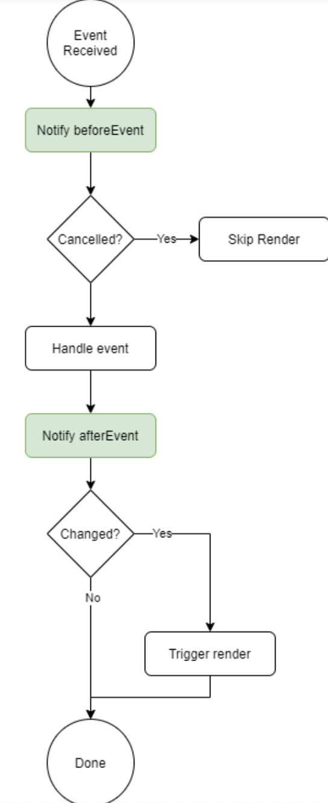

*Hello again and welcome to another read, today we have three topics to talk about, so let's get going*

# Forms

A form is a printed document that has black space for the users to fill, but what does that have to do with web programming? In HTML browsers forms is the concept of collecting information from visitors to the site, much like the paper form,

there are plenty shapes of forms to use and pick from such as text input, password input, text area, checkboxes, drop down boxes, submitting information and uploading files, perhaps the most popular form on the internet is the search box on Google.com

The user inputs the data that is required and submits it, then the browser send this data to the server and the servers translates it to its programming language then the server creates the webpage that should be sent to the user based on the information that they provided

Form structure is basically the **< form>** element that contains the form structure, then the as every form would require the action property which is divided into 2 separate methods that are **get** or **post** 

of course this is a general idea but we don't want to get in too deep right now in understanding forms as each type has its own properties and unique executing methods, like when we want the user to input a text we use **< input>** followed by type, name, size, max length, and the same goes for the rest of the different forms methods like passwords, text area, radio buttons, etc

we can as web developers group form elements, by using the **< fieldset>** element and the **< legend>** element that follows it to give this group of forms a title, like contact details or signing up information,

HTML5 allow us to create something call *form validation* which is basically a way of giving every form box a meaningful task that the user can read to understand what is the user supposed to fill in this form, 

Forms are supposed to be interactive and sometimes when there are too many boxes to fill, the end user might get bored with submitting all this data, so CSS allowed us to style these form to make them more appealing and easier to fill without forcing the user to read too many information in order to fill this form correctly, like styling the text form for submitting and Email address with a picture of a letter instead of saying "enter your Email here", or giving a simple coloring or background color or even shadow to a register button 

---

# Styling Lists and Tables

CSS gave us the freedom to style and make anything on the webpage look appealing and easy on the eyes, including the lists, tables and also forms, we've talked about styling forms now we'll talk about styling lists and tables 

there many ways to style a list such as bullet point styles for an unordered list which can be styled into disc, circle, square, decimal, alpha in both lower and upper cases or roman in also lower and upper cases as well, what have you,

we can as well add images to these bullet styles like a picture of a star or a check mark

As for styling a table, as well as we discussed with the forms and lists, tables have endless possibilities and methods to style like controlling the width, padding, text transforming, letter-spacing, border-top,border-bottom, font size, text-align, background-color and maybe if you're feeling a little bit extra you can add a hover which will change the background color of the cell when you move the mouse over it

we can also give the cells some padding, or distinguish headings by putting all headings in a bold for example,

not only the content of the table is stylable but also the borders between cells, like showing or hiding the lines of the table, or give spaces between them by using collapse or seperate,

---

# Events

as we talked before about how the browsers are the middle man between the user and the programmer, and event is the way the browser tells the script that there's some sort of action detected, what should I do, so the script can execute the command correctly as the developer intended,

there are hundreds of event types and go through them in one read is impossible but to name a few, there's for example the mouse click on a certain of the webpage, or a keyboard letter press, or sometimes a UL events, we'll be discussing how the script handles these events 

first of all the event triggers the code, through accessing a certain DOM element in that code, then the code selects what to execute based on that DOM node via what code is related to it

as you can see from the image above, js selected the element, then it specified the event, then it called the code 

there are three ways to bind an event to an element

* HTML event handles, this is used in very old codes and is considered a bad practice and nobody uses it anymore because it relates the handling  of the event to the HTML build 

* Traditional DOM event handlers this gives us the freedom to separate the Javascript from the HTML, but its main weakness is that it only reacts to one event at a time which limits the whole responsiveness of the web build

* DOM level 2 event listeners this is the most efficient and responsive ones because it operates on a newer method of coding that allows one code to trigger more than one event, but its setback that it doesn't work on old version browsers

as everything in web building and designing all codes should flow, so how does events flow? 
the event flows in two ways as this image will from the ducket will demonstrate further 

it can go outwards which is called event bubbling (starts small and grows like a bubble), or it can start big and go small which is called event capturing

But why does flow matter? it matters only when the code has event handles on one element or one of its ancestors elements 

events can be mutated when elements are added to or removed from the DOM, its structure changes. This change causes a mutation in the event. So whenever a the script has multiple mutations occuring this can make the webpage slow or sometimes unresponsive , so that's why there are new mutation observes created which will wait until the script has finished its task before reacting then it reports the changes as a patch, 

>The most commonly used events are W3C DOM events, which is short for World Wide Web Consortium, the DOM defines a standard for accessing documents: "The W3C Document Object Model (DOM) is a platform and language-neutral interface that allows programs and scripts to dynamically access and update the content, structure, and style of a document."
##### source: w3shools.com

---

this was my summary of today's read, I hope I didn't make it long thus boring you, nor too short making the reading lacking information,

