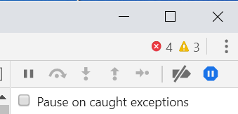
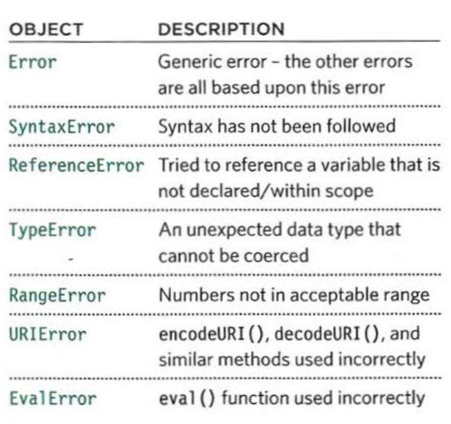

# Error Handling & Debugging

Today we will be talking about error handling and debugging

as a begginer Javascript is quite challenging for me to learn, so I hope this chapter will help me how to spot errors in my code and how to handle them 

there are many ways to help a developer spot am error in their code, some are built in the browser especially modern reliable ones like firefox and chrome 
 
 

 this is a verry efficiant tool, besides to the modern web programming softwares themselevs, any new web coding software like visual studio have built in error detection, which will help us spot errors as we are building the web design,

 now that we know how to spot an error, how do we handle it?

 to handle an error we must understand what an error mesage means, here's a list of most commmon error massages and what they mean, 

understanding what these objects mean, is hald the solution to handle these errors, 

there are two approaches to handle an error

* Debug the the script to fix the errors using the browser as we talked before

* Handle errors gracefully, by using try, catch, throw and finallyStatement because sometimes the error may be due to reasins beyond our control like when a server is not responding or some sort of third party software that is refusing to cooperate with out code

## Debugging:
here are the steps required for a propper debugging,

1) look at the error message
2) check how far the script is running
3) use the breakpoints where things are going wrong

Breakpoints allows us to pause the execution of a script on any line using breakpoints. Then you can check the values stored in variables at that point in time.

Conditional breakpoints is that when a breakpoint should be triggered only if a condition that we specify is met. The condition can use existing variables.

what is Try, Catch, Finally?

Try: is when we specify when the code might throw an exception, and when that happens it moves to the catch block,

Catch: when the catch block receives a try block it runs an altertnative set of code 

Finally: the contents of a a finally block will run wheather the try and catch block succed or fail 

we can always use other ways to debug an errors like earching on google the error message or try running the code with another browser, or go to stackoverflow to ask fellow developers for a solution to our problem

and we should always keep in mind that Javascript is case sensitive so keep an eye out for mispelled charachters, and or extra or missing charachters, or sometimes a missed semi colon or any data type issue

thank you for taking the time to read my thoughts on what I read from this chapter