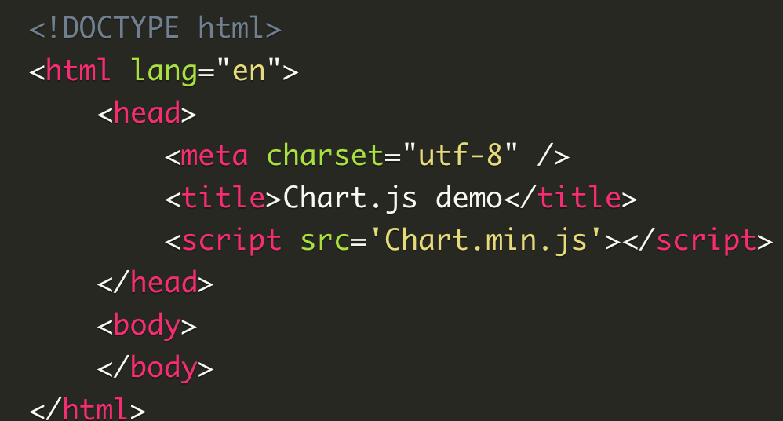

Hello again, today we will be talking about Chart.js, Canvas which are two unique let's say tools for adding graphics tp our web build

# Chart.js
according to wikipedia
> Chart.js is a free open-source JavaScript library for data visualization, which supports 8 chart types: bar, line, area, pie, bubble, radar, polar, and scatter

charts are very easy way to deliver infographics for the end user, and coding them by hand might be a little bit complicated so Chart.js made it easier to add them to our code without the actual hassle of typing the code which will save us a lot of time and their way of coding is very clear and easy to tweak to our desired result, we just have to know to start, first of all we need to download Chart.js then copy the Chart.min.js out of the unzipped folder to our directory then import the script to our HTML build

another way to get a chart appearing in our site is to include in our page along with a single < canvas> node to render the chart.

then we follow it with a script tag if it's in the HTML page or just link it to our Javascript page

once we have that all figured out we can go to their website and pick what type of chart we want to use and just copy the code either in our Javascript page or in our html page, and just like that it will appear in our website all thanks to https://www.chartjs.org/

---

# Canvas API

Canvas is very much like the img attribute without the src and the alt in it, it runs on modern browsers and can include in it anything like audio, video, and simple pictures, it will be by default 300 pixels wide and 150 pixel high, but it can be modified using CSS,

in order to avoid having a fallback content due old browsers not being able to run the canvas element we must provide the code with alternate content, so modern browsers will ignore the alternate content, and old browsers will ignore the canvas itself, and unlike the img tag canvas requires the closing tag < /canvas> otherwise the rest of the content will be considered fallback content and modern browsers will ignore it

Not only that but we can draw shapes with canvas like rectangles, paths, triangles, lines, arcs, and curves, as well as applying styles and colors and making them transparent or increase their line width, or line dashes, we can also use canvas to create line join, line cap and type of gradient concepts in addition to creating patterns and shadows or filling shapes

canvas has a wide variety of real life applications that we can use not only drwaing but also styling texts like text filling, text stroking, text coloring and or control the text measurments, 

if you think about it, canvas is like an artists' canvas that gives you a blank page and allows you to show your creations on it