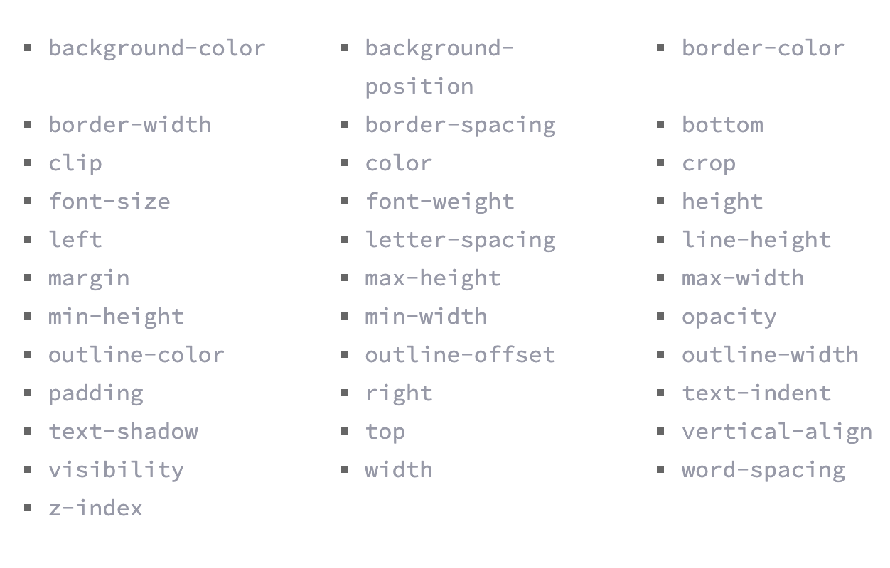

# CSS Transforms, Transitions, & Animations

---

## CSS Transforms
CSS gave us as web developers many tools to decorate our website to make it look as appealing as possible one of these tools is the **transform** property that allow us to transform in 2D and 3D with each having it's own values and properties, transform property includes multiple vendor prefixes to gain the best support across all browsers. The un-prefixed declaration comes last to overwrite the prefixed versions, should a browser fully support the transform property.

The main difference between two dimensional and three dimenstional is that 2D work on x and y axis, while the 3D work on x, y, and z axis, among these transformations is the 2D rotate rotate, 2D scale, 2D demo, 2D skew, and the ability to combine between any of these transformations, as well as change a perspective, a perspective depth value, a perspective origin,

CSS 3 evolved to allow for developers to write code for transitions and animations without the need to Javascript or flash, With CSS3 transitions we have the potential to alter the appearance and behavior of an element when we hover over it, There are four transition related properties in total, including 
* transition-property, 
* transition-duration, 
* transition-timing-function,
* transition-delay.
 
 the image below will show some of the transitional properties, 

 

 we can also control its duration, timing, or delay 

 also we can make animations with CSS3 by selecting animation name, then we set the animation duration, timing function and delay

 there's as well the animation animation iteration and direction and it's play state and speed